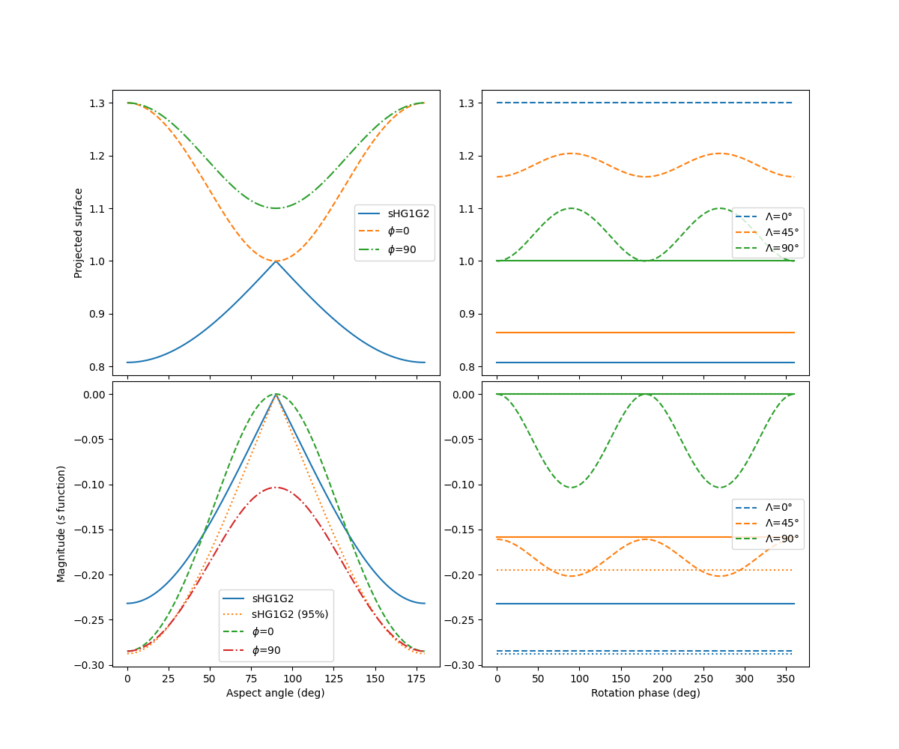

---
title: "ssHG1G2"
author: [B. Carry]
date: "2024-10-17"
...
# Introducing spinning potatoes with HG1G2

@Max, feature request pour phunk : **spotHG1G2**!

[Il faut trouver un meilleur nom] mais j'ai ecrit une amelioration a sHG1G2: un ellipsoid 3d (a>=b>=c) qui tourne sur lui meme. Donc c'est toujours

$H = m - f - g - s$

mais le s est different, c'est

$s = s(ra_0, dec_0, period, a/b, a/c, rotation_0)$

--> on a la direction du pole, et les 2 rapports de taille. 
:-)

# Modele

- **TOP** la surface projetee sur le ciel
- **BOTTOM** la magnitude
- $\Lambda$ l'angle d'aspect
- $\phi$ la rotation

On voit bien comment la nouvelle fonction **s** est plus *douce* (pas de
point anguleux a l'equateur) en comparaison avec ce qu'on avait ecrit l'an dernier.

Autre chose, l'amplitude de la LC entre 0-90-180 d'aspect angle est legerement differente avec les 2 fonctions, alors meme que pour ce schema, les valeurs sont coherentes -> a explorer: peut etre que notre probleme sur l'oblateness **R** venait de la?

# Exemples

## (9799) Thronium

Un troyen, illustration du gain en RMS:

Et voila pourquoi le RMS est meilleur: sur le "court" terme, on attrape la variabilite due a la rotation!

## (5209) Olooson

Beaucoup d'observations, gros residus sHG1G2

## (186153) 2001 UN66

Un objet avec des observations a haute cadence, donc on voit la LC sur une nuit. 

## Conclusion preliminaire

Ca **maaaaaaaaaaaarche**

## Trucs positifs

- Les RMS semblent plus petits qu'avec sHG1G2
- Les incertitudes {H,G1,G2} sont plus petites
- Les valeurs changent un peu mais pas complement (ouf!)
- Parfois les G1G2 de sHG1G2 etaient mauvais et deviennent valides (G1=1 -> G1=0.87...)!
- C'est pas tres long comme inversion, le plus long est le Lomb-Scargle pour la periode entre sHG1G2 et spotHG1G2

## Trucs ~positifs

- La solution est-elle stable? unique? C'est clairement **LE** point important: car ok on a un chi2 minimum... mais ca veut dire quelque chose?
- Il faut nettoyer le code
- Il faut faire tourner sur N>>1 SSOs pour conclure pour de vrai, voir quand ca marche, marche pas
- Je dois ameliorer plusieurs aspects
  - Periode siderale au lieu de synodique (eq. 12.4 RIEA) pour casser la degenerescence du spin
  - Algorithme pour trouver les valeurs initiales des $a/b$ et $a/c$ 
  - Valeur initiale de la **periode** ?!

Bref, on en est juste au debut, mais c'est prometteur!

